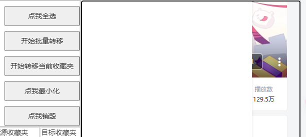

### 右侧面板自动更改大小的问题：
  
先放大，再缩小无法实现，猜测的原因：
rightPanel.style.width = "auto"，会自动适应内部元素的宽度，
但是内部的outputTextBox 绑定了事件，判断rightPanel大小更改时，适应其大小。

问题就出在这里：放大可以，因为 rightPanel 设置了 flex-grow: 1，所以 floatingPanel 放大， rightPanel 自动增长放大，outputTextBox 跟随绑定的事件放大。
缩小时，floatingPanel缩小，rightPanel不会缩写，因为 width="auto"， 只有它内部的outputTextBox缩小时，rightPanel才会缩小。 然而 outputTextBox 缩小的条件是：rightPanel缩小，所以就陷入了死循环。  
像OS中的死锁一样。英文名字叫做：Deadlock


```js
    this.rightPanel.style.display = "flex"
```

加上这么一句话就行了，哈哈，可能分析地不正确，但是解决了问题。


### overflow 和 flex-grow 的问题，不能自动添加scrollbar
右侧的输出框，添加内容后，会自动增长，但是不会自动添加滚动条。
但是如果先拖拽右侧面板，再添加内容，就会自动添加滚动条。
猜测是因为 floatingPanel没有设置 height， 当加载完 floatingPanel后，再设置 height，就会自动添加滚动条。
```js
    recordPanelSize() {
        this.minH = this.floatingPanel.offsetHeight;
        this.minW = this.floatingPanel.offsetWidth;
        //这很重要
        this.floatingPanel.style.width = this.minW + "px";
        this.floatingPanel.style.height = this.minH + "px";
    }
```

### 布局问题继续
  

右侧outputTextBox 的whiteSpae设置为 'nowrap',不允许折行显示.
然后overflow设置为 'auto'或者 'scroll',允许滚动条显示。


  

这里是 outputTextBox 的 flexGrow = "0"; 所以 rightPanel增大时, outputTextBox不会增大，所以看到了rightPanel的背景色.


  

这里是 rightPanel出现了滚动条, outputTextBox想办法不能scroll

```
rightPanel.style.overflow = "auto"; 
```
如果不添加这一句,就会导致rightPanel没办法缩小,不太清楚原因.但是面板确实可以向里缩小,但是显示出来还是 outputTextBox的大小.
感觉是当你缩小floatingPanel时,floatingPanel确实缩小了,
但是rightPanel因为包含一个outputTextBox,无法缩小,


  

floatingPanel 设置 overflow = "auto"，可以自动添加滚动条


?
为什么leftpanel 可以缩小,而rightpanel 不设置 overflow = "auto" 就不行呢?
可能因为leftPanel是 横向摆放的,所以可以缩小,而rightPanel是纵向摆放的,所以不行?

  

可能是因为outputTextBox设置了 width
如果不是 column, rightpanel的outputTextBox是可以正确填充右侧扩大的内容的.

```
rightPanel.style.overflowX = "hidden";
```
这样也行!!!


用min-width代替width,这样初始 初始是200px,并且可以放大可以缩小
```
editableArea.style.minWidth = "200px";
```

```js
// rightPanel.style.overflowX = "hidden";
rightPanel.style.minWidth = "200px";
```
这样还是没太大效果