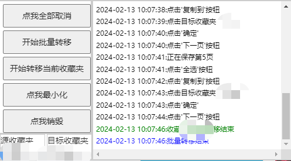
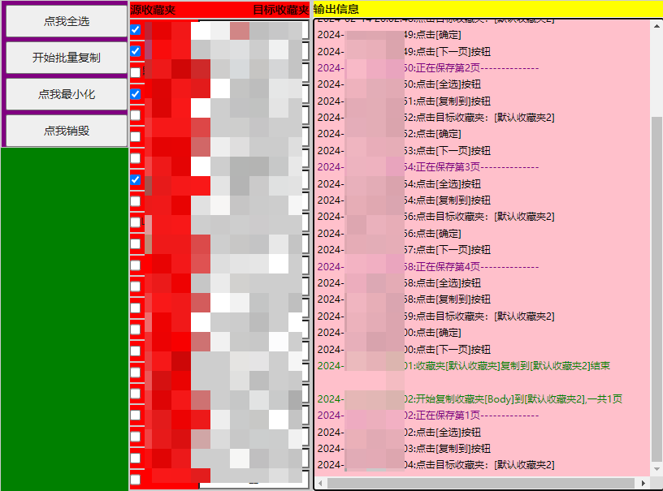

# contact me
qq group: 524764959

email: ljx.1024@outlook.com

https://github.com/junxian-li-hpc/bilibili-favs-manage

# initial publish version v0.1
2024-02-13
使用方法，打开要转移的网页，3秒后会弹出窗口，之所以3秒是因为脚本会自动从网页中获取收藏夹的名字，所以要确保网页加载完毕，这一点之后可以优化为一个刷新按钮。
然后左下角会显示检测到的收藏夹，点击全选，然后点击开始批量转移，就可以自动进行转移。

转移规则：现在的规则是检测你的收藏夹是否有同名收藏夹，如果没有则自动创建然后添加；如果有则直接添加到该收藏夹中。

也可以实现单个收藏夹转移，先点击你要复制的别人的收藏夹，然后点击[开始转移当前收藏夹]，脚本就开始执行了。

可以拖拽移动窗口，可以在四边放大或缩小。

  

## bugs
[点我最小化] 会有bug，会将右侧的输出框关闭，但是可能面板的大小不会更改。

## todos
刷新按钮，点击后重新检测网页中的收藏夹列表。
`目标收藏夹`还没有使用，可以添加自定义目标收藏夹功能。
在输出框中显示帮助信息。
保存输出框的内容。

可以扩展为收藏夹管理工具，不仅是复制别人的收藏夹。
如：统计自己收藏夹的内容，进行去重、导出链接；批量从一个收藏夹转移到另一个收藏夹。

# 2024-02-15 v0.5
可以自定义目标收藏夹了. 试着写了一下 ui,更改大小,移动位置等等.

todo:
判断目标收藏夹如果已满,则自动创建新的收藏夹.
现在只是复制,可以添加移动到的功能.
输出框在用户点击后,不再自动滚动.

bugs:
打开网页后就需要保持在这个状态不变,如果手动点了[批量操作],再执行脚本,就找不到[批量操作]这个按钮了.

## 
  
